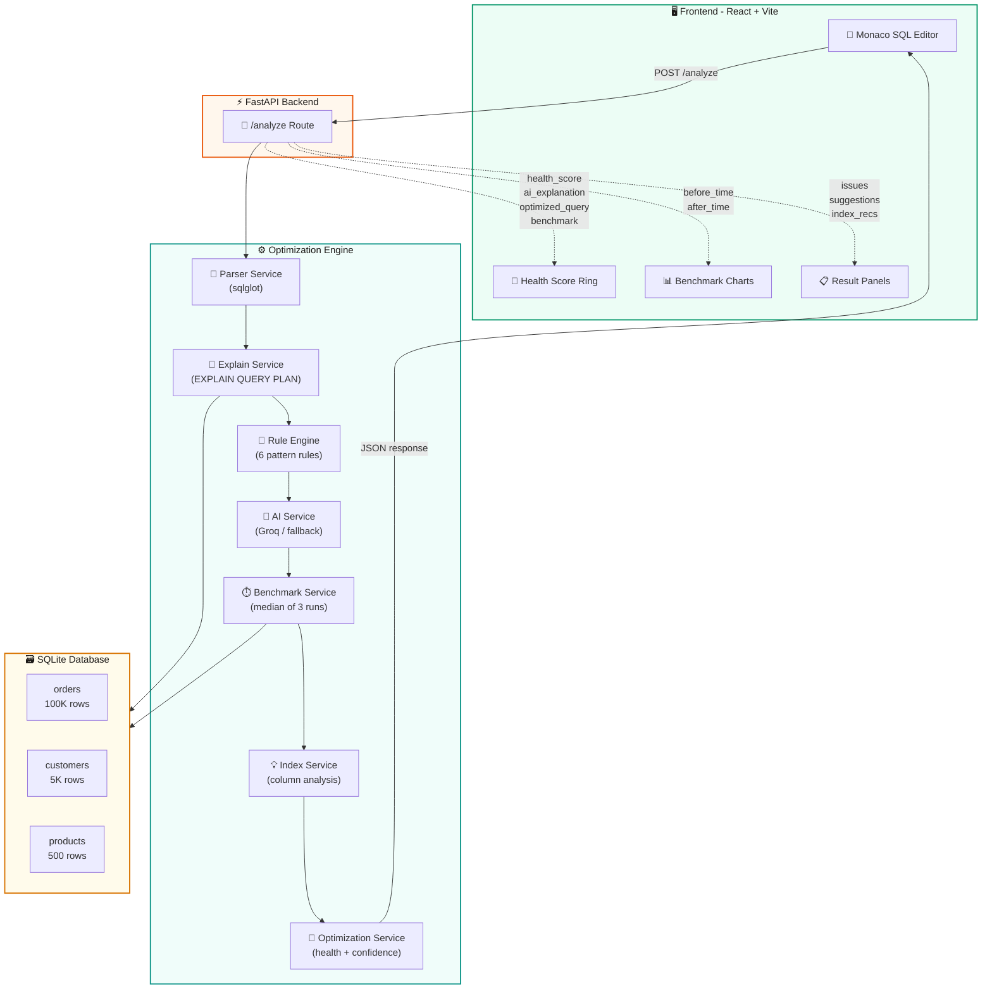
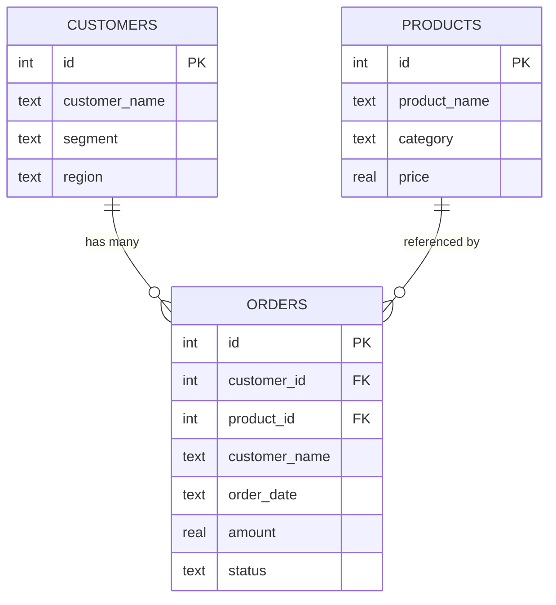
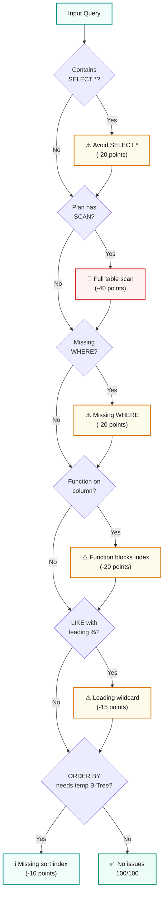
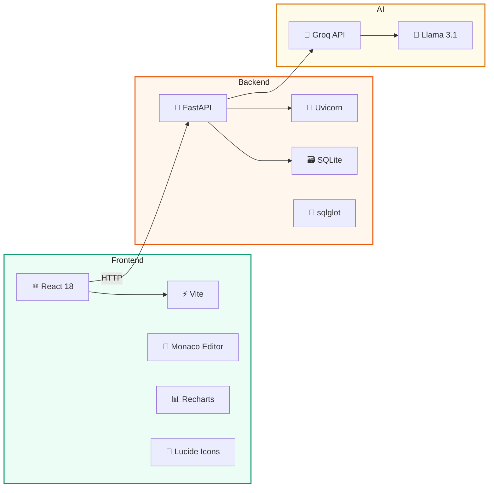

# 🚀 OptiQuery

### Smarter Queries. Faster Databases.

OptiQuery is an AI-powered SQL optimization dashboard. It accepts SQL queries, runs them against SQLite, analyzes `EXPLAIN QUERY PLAN`, detects bottlenecks, recommends indexes, rewrites inefficient SQL with Groq AI, benchmarks before/after runtime, and displays everything in a clean developer-focused UI.

---

## ✨ Features

- 🖥️ Monaco code editor with SQL syntax highlighting
- 🎯 Animated health score ring (0–100) with color-coded severity
- 🤖 AI-powered query explanations via Groq (with local fallback)
- ✏️ Automatic SQL rewrite removing anti-patterns
- 📊 Before/after runtime benchmark charts
- 🔍 Rule-based bottleneck detection with severity tags
- 📋 Index recommendations based on query patterns
- 🎬 Interactive demo guide with step-by-step checklist
- ⌨️ Keyboard shortcut: `Ctrl+Enter` to analyze
- 🗃️ SQLite demo database with 100K orders, 5K customers, 500 products

---

## 🏗️ System Architecture



---

## 🔄 Complete Analysis Workflow

```mermaid
flowchart LR
    A["✏️ User writes\nSQL query"] --> B["▶️ Click Analyze\nor Ctrl+Enter"]
    B --> C{"🔎 Parse SQL\n(sqlglot)"}
    C -->|"Invalid"| ERR["❌ Error\nshown to user"]
    C -->|"Valid SELECT"| D["📖 Run\nEXPLAIN QUERY PLAN"]
    D --> E["🧩 Apply 6\ndetection rules"]
    E --> F["🤖 Generate AI\nexplanation"]
    F --> G["✏️ Rewrite\noptimized SQL"]
    G --> H["⏱️ Benchmark\noriginal vs optimized\n(3 runs, median)"]
    H --> I["💡 Suggest\nindexes"]
    I --> J["📐 Calculate\nhealth score\n+ confidence"]
    J --> K["📊 Display\nresults"]

    style A fill:#ecfdf5,stroke:#059669,stroke-width:2px,color:#1c1917
    style B fill:#ecfdf5,stroke:#059669,stroke-width:2px,color:#1c1917
    style C fill:#fff7ed,stroke:#ea580c,stroke-width:2px,color:#1c1917
    style ERR fill:#fef2f2,stroke:#dc2626,stroke-width:2px,color:#1c1917
    style D fill:#f0fdfa,stroke:#0d9488,stroke-width:2px,color:#1c1917
    style E fill:#f0fdfa,stroke:#0d9488,stroke-width:2px,color:#1c1917
    style F fill:#fffbeb,stroke:#d97706,stroke-width:2px,color:#1c1917
    style G fill:#fffbeb,stroke:#d97706,stroke-width:2px,color:#1c1917
    style H fill:#f0fdfa,stroke:#0d9488,stroke-width:2px,color:#1c1917
    style I fill:#f0fdfa,stroke:#0d9488,stroke-width:2px,color:#1c1917
    style J fill:#fff7ed,stroke:#ea580c,stroke-width:2px,color:#1c1917
    style K fill:#ecfdf5,stroke:#059669,stroke-width:2px,color:#1c1917
```



---

## 🗃️ Database Schema



**Seed Data:**

| Table | Rows | Key Columns |
|-------|------|-------------|
| `customers` | 5,000 | `customer_name`, `segment`, `region` |
| `products` | 500 | `product_name`, `category`, `price` |
| `orders` | 100,000 | `customer_name`, `amount`, `order_date`, `status` |

---

## 🧩 Rule Engine Flowchart



---

## 🛠️ Tech Stack



---

## 📁 Project Structure

```
backend/
  app/
    api/
      routes.py              # POST /analyze endpoint
    db/
      database.db            # SQLite demo database
      db_connection.py       # Connection manager with WAL mode
      seed_db.py             # Generates demo data
    rules/
      query_rules.py         # Pattern-based issue detection
    services/
      ai_service.py          # Groq AI + fallback logic
      benchmark_service.py   # Multi-run median benchmarking
      explain_service.py     # EXPLAIN QUERY PLAN parsing
      index_service.py       # Index recommendation engine
      optimization_service.py  # Health score + confidence
      parser_service.py      # SQL validation via sqlglot
    main.py                  # FastAPI app + CORS
  requirements.txt

frontend/
  src/
    components/              # 7 reusable UI components
    data/                    # Demo query templates
    hooks/                   # State management
    layout/                  # App shell (nav + footer)
    pages/                   # 3 page routes
    services/                # API client
    App.jsx                  # Router config
    main.jsx                 # Entry point
    styles.css               # Design system
  index.html
  package.json
```

---

## 🚀 Quick Start

### Backend

```bash
cd backend
pip install -r requirements.txt
python app/db/seed_db.py
uvicorn app.main:app --host 127.0.0.1 --port 8000
```

### Frontend

```bash
cd frontend
npm install
npm run dev
```

Open **http://localhost:5173**

### Groq AI (Optional)

Without an API key, OptiQuery uses local fallback. The demo works fully offline.

```powershell
# PowerShell
$env:GROQ_API_KEY="your_key_here"
$env:GROQ_MODEL="llama-3.1-8b-instant"
```

```bat
:: CMD
set GROQ_API_KEY=your_key_here
set GROQ_MODEL=llama-3.1-8b-instant
```

---

## 📡 API Reference

| Method | Endpoint | Description |
|--------|----------|-------------|
| `GET` | `/health` | Health check |
| `POST` | `/analyze` | Analyze a SQL query |

**Request:**

```json
{
  "query": "SELECT * FROM orders WHERE LOWER(customer_name) = 'john';"
}
```

**Response fields:**

| Field | Type | Description |
|-------|------|-------------|
| `health_score` | `int` | Query quality (0–100) |
| `ai_explanation` | `string` | Plain-language analysis |
| `optimized_query` | `string` | Rewritten SQL |
| `issues` | `string[]` | Detected anti-patterns |
| `suggestions` | `string[]` | Optimization tips |
| `index_recommendations` | `string[]` | CREATE INDEX DDL |
| `before_time` | `float` | Original runtime (s) |
| `after_time` | `float` | Optimized runtime (s) |
| `improvement_percent` | `float` | Speed improvement % |
| `confidence` | `int` | Confidence (0–95) |
| `plan` | `object[]` | EXPLAIN QUERY PLAN |
| `columns` | `string[]` | Column names |
| `rows` | `object[]` | Preview rows (max 100) |

---

## 🧪 Demo Queries

| # | Query | Anti-Pattern |
|---|-------|-------------|
| 1 | `SELECT * FROM orders WHERE LOWER(customer_name) = 'john'` | Function blocks index |
| 2 | `SELECT * FROM orders` | Full table scan |
| 3 | `SELECT * FROM orders ORDER BY amount` | Sort without index |
| 4 | `SELECT * FROM orders WHERE customer_name LIKE '%john%'` | Leading wildcard |
| 5 | `SELECT o.*, c.segment FROM orders o JOIN customers c ...` | Unfiltered join |

---

## 🎯 Optimization Rules

| Rule | Severity | Score Impact |
|------|----------|-------------|
| `SELECT *` usage | ⚠️ Warning | -20 |
| Full table scan | 🔴 Critical | -40 |
| Missing `WHERE` clause | ⚠️ Warning | -20 |
| Function on column (`LOWER()`, etc.) | ⚠️ Warning | -20 |
| Leading wildcard `LIKE '%...'` | ⚠️ Warning | -15 |
| `ORDER BY` without index | ℹ️ Info | -10 |

---

## 🎬 Demo Flow

```mermaid
flowchart LR
    A["1️⃣ Open\nAnalyzer"] --> B["2️⃣ Load\nTemplate"]
    B --> C["3️⃣ Click\nAnalyze"]
    C --> D["4️⃣ Show\nHealth Score"]
    D --> E["5️⃣ Walk through\nAI Explanation"]
    E --> F["6️⃣ Apply\nOptimized SQL"]
    F --> G["7️⃣ Show\nBenchmarks"]
    G --> H["8️⃣ Close with\nMeasurable Results"]

    style A fill:#ecfdf5,stroke:#059669,stroke-width:2px,color:#1c1917
    style B fill:#ecfdf5,stroke:#059669,stroke-width:2px,color:#1c1917
    style C fill:#fff7ed,stroke:#ea580c,stroke-width:2px,color:#1c1917
    style D fill:#f0fdfa,stroke:#0d9488,stroke-width:2px,color:#1c1917
    style E fill:#fffbeb,stroke:#d97706,stroke-width:2px,color:#1c1917
    style F fill:#fff7ed,stroke:#ea580c,stroke-width:2px,color:#1c1917
    style G fill:#f0fdfa,stroke:#0d9488,stroke-width:2px,color:#1c1917
    style H fill:#ecfdf5,stroke:#059669,stroke-width:2px,color:#1c1917
```



---

## 💡 Why OptiQuery?

Most SQL tools show raw `EXPLAIN` output. OptiQuery goes further:

| Feature | Basic Tools | OptiQuery |
|---------|-------------|-----------|
| Show execution plan | ✅ | ✅ |
| Plain-English explanation | ❌ | ✅ AI-powered |
| Auto SQL rewrite | ❌ | ✅ |
| Index recommendations | ❌ | ✅ Ready-to-run DDL |
| Before/after benchmarks | ❌ | ✅ Median of 3 runs |
| Health scoring | ❌ | ✅ 0–100 score |

---

## 🔮 Future Work

- PostgreSQL and MySQL support
- CI/CD query check integration
- Query history persistence
- Cost-based optimization analysis
- Live database monitoring

---

## 📄 License

See [LICENSE](LICENSE).
